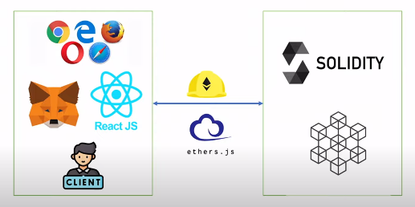
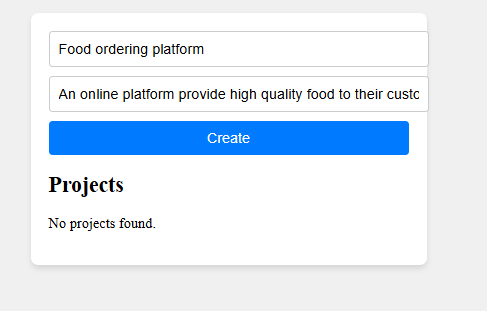
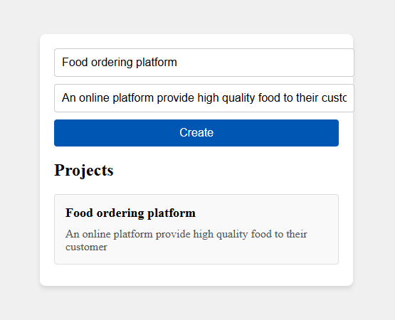

# Hardhat ReactJS MetaMask Ethers Smart Contract DApp
This project demonstrates how to build a decentralized application (DApp) using modern web3 technologies. It integrates Hardhat for smart contract development and testing, ReactJS for the frontend, MetaMask for wallet connectivity, and Ethers.js for interacting with the Ethereum blockchain.


---

## 🚀 Getting Started
### Navigate to the contract folder and install hardhat and dotenv
### 1️⃣ Install Hardhat

```sh
npm install hardhat
```

### 2️⃣ Initialize Hardhat Project

```sh
npx hardhat init
```

It will prompt some questions—choose the appropriate settings to set up the project.

### 3️⃣ Write the Smart Contract (Solidity)

Navigate to the `contracts/` folder and create your Solidity contract (`.sol` file).

### 4️⃣ Compile Smart Contract

```sh
npx hardhat compile
```

### 5️⃣ Write and Run Smart Contract Tests

Define test cases in the `test/` folder, then run:

```sh
npx hardhat test
```

### 6️⃣ Deploy Smart Contract to Sepolia Testnet

#### Configure Network (Etherscan, MetaMask, Alchemy API Keys)

Modify `hardhat.config.js` to include:

```js
module.exports = {
  solidity: "0.8.28",
  etherscan: {
    apiKey: {
      sepolia: <ETHERSCAN_API_KEY>,
    },
  },
  networks: {
    sepolia: {
      url: `https://eth-sepolia.g.alchemy.com/v2/${<ALCHEMY_API_KEY>}`,
      accounts: <SEPOLIA_PRIVATE_KEY>,
    },
};
```

#### Write Deployment Script

Create a `scripts/deploy.js` file and define the deployment logic.

#### Deploy the Contract

```sh
npx hardhat run scripts/deploy.js --network sepolia
```

### 7️⃣ Verify the Contract on Etherscan

```sh
npx hardhat verify --network sepolia <CONTRACT_ADDRESS> <CONSTRUCTOR_ARGUMENTS>
```

---

## 💻 Setting Up Frontend (React + Ethers.js)

### 1️⃣ Initialize React Vite App

```sh
npm create vite@latest
cd client
npm install
```

### 2️⃣ Install Ethers.js

```sh
npm install ethers
```

### 3️⃣ Connect Frontend with Smart Contract

To interact with your smart contract from the frontend, you need two things:

1️⃣ Contract ABI – Located inside:
contract/artifacts/contracts/SimpleProject.sol/SimpleProject.json

2️⃣ Contract Address – Stored inside the abi folder within the contract directory.

Once you have these, you can easily integrate your smart contract with the frontend using Ethers.js.

## Overview 
The UI shows the correct implementation of how the data coming from the contract



## 🎯 Conclusion

This is a simple project that demonstrates how to interact with Hardhat, Solidity, Ethers.js, MetaMask, and ReactJS to build a full-stack decentralized application (DApp).

✅ Hardhat for smart contract development and testing
✅ Solidity for writing Ethereum contracts
✅ Ethers.js for interacting with the blockchain
✅ MetaMask for wallet authentication
✅ ReactJS for building the frontend UI

Enjoy building! 🚀

